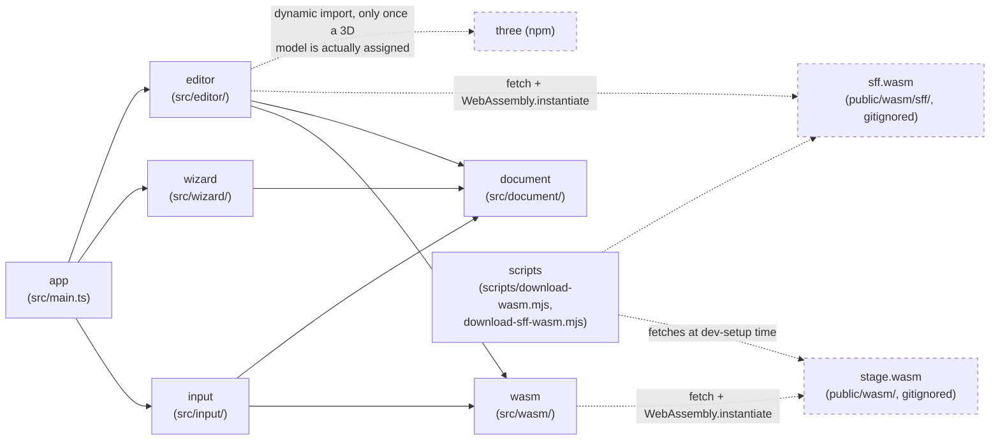

> Generated by /vibe:docs — manual edits will be overwritten; use README for hand-written content.

# Architecture

## Big picture

`stage-editor` is a static, backend-less site. All stage `.def` parsing and
serialization happens client-side, in the browser, through a WebAssembly
module built from the sibling [`stage`](https://github.com/openkakutou/stage)
Go library — this repo never reimplements `.def` parsing itself. Unlike the
sibling [`stage-viewer-web`](https://github.com/openkakutou/stage-viewer-web),
this app is write mode: it uses the same `stage.wasm` binary's `save` export
in addition to `load`.

- **`app`** (`src/main.ts`, `src/version.ts`, `src/style.css`) — the entry
  point. Builds the root layout: the org's shared `@openkakutou/web-ui-kit`
  app shell, a toolbar (app title + version) plus the stage file input,
  the New Stage Wizard (backlog item 005), the characteristics editor, the
  BG element editor, and the Save/Export button as main content. A loaded
  file and a wizard-created stage both funnel into the same
  `mountDocument` wiring, so the editors appear the same way regardless of
  entry point; a wizard-driven creation additionally moves focus into the
  characteristics editor's first field, since the wizard has no second
  confirm screen of its own to give that positive feedback. No
  sidebar/tabs slotted yet.
- **`input`** (`src/input/`) — the stage folder input (backlog item 002).
  `folder-entries.ts` gathers files from a folder selection or a
  drag-and-drop. `stage-file-input.ts` picks which gathered file is the
  stage's own `.def` (auto if there's exactly one, otherwise the caller
  must ask the user), reads and loads it through `wasm.loadStage`, then
  resolves the `.def`'s referenced sprite sheet from that same folder
  listing by filename — see the identical logic's own rationale in
  `stage-viewer-web`'s `.vibe/decisions/001-sprite-sheet-resolved-by-basename-with-case-insensitive-fallback.md`
  (ported here verbatim, not re-derived). `stage-file-input-view.ts`
  renders the folder-picker + drag-and-drop UI on top of that logic — the
  same success/error copy as `stage-viewer-web`'s own view, since nothing
  about the interaction is editor-specific yet.
- **`document`** (`src/document/`) — `stage-document-store.ts` holds the
  currently loaded stage in memory (a plain module-level get/set pair, no
  persistence): the file name, the parsed `StageData`, the original
  `.def` bytes (needed later by `saveStage`'s byte-exact-if-unchanged
  comparison), and the resolved sprite sheet's name/bytes. The single
  place editor screens (characteristics, BG element, save/export) read
  from and write back to. `set` always fully replaces the previous
  document, with no confirmation of its own — the store only tracks
  *whether* the loaded stage has unsaved edits
  (`hasUnsavedStageChanges`, backlog item 005), as a JSON snapshot-diff
  against whatever state was last known clean (loaded, created, or
  saved), rather than a boolean an editor's `onChange` callback flips;
  see "New Stage Wizard" below and
  `.vibe/decisions/003-new-stage-defaults-and-unsaved-changes-guard.md`
  for why. Deciding what to do about an unsaved-changes answer (the
  discard-confirmation prompt) belongs to the caller, not this store.
- **`wizard`** (`src/wizard/`) — the New Stage Wizard (backlog item 005).
  `new-stage-defaults.ts` is pure data: `createBlankStage()` builds a
  minimal valid stage (standard 320×240 coordinate space, sensible
  non-degenerate camera bounds/boundaries, zero BG elements);
  `STAGE_TEMPLATES` is a small, fixed list of named starter layouts, each
  pre-populated with example BG elements whose sprite reference is the
  established "not yet assigned" sentinel (`{-1, -1}`) rather than a
  fabricated fake reference, since a from-scratch stage has no real
  sprite sheet attached yet — a fabricated reference would show as a
  false "invalid reference" error. `new-stage-wizard.ts` renders the
  "Blank Stage" + template buttons as their own visually distinct
  section (own heading) next to the folder input, gated by
  `hasUnsavedStageChanges`/an injectable `confirmDiscard` (defaulting to
  the browser's native `confirm`, with a message naming the consequence)
  before replacing the current document.
- **`wasm`** (`src/wasm/`) — the bridge to the `stage` WebAssembly module.
  `bridge.ts` loads `wasm_exec.js` and instantiates `stage.wasm`
  client-side (both fetched from `public/wasm/`, gitignored — see
  "WebAssembly dependency" below), then exposes two typed wrappers:
  `loadStage(...)` around `OpenKakutouStage.load`, and `saveStage(...)`
  around `OpenKakutouStage.save` — the write-mode addition this repo needs
  that `stage-viewer-web`'s read-only bridge doesn't. `types.ts` is the
  TypeScript mirror of the module's JSON contract (`StageData` and its
  nested shapes, plus `StageResult`/`SaveResult`) — pure data types, no
  parsing logic.
- **`scripts`** (`scripts/download-wasm.mjs`, `download-sff-wasm.mjs`) —
  dev-only tooling, not part of the shipped app bundle. The first fetches a
  pinned `stage` release's `stage.wasm` + `wasm_exec.js` into `public/wasm/`;
  the second, a separate script (not a shared parameterized one — each
  downloads a different producer repo's release), fetches a pinned `sff`
  release's own `sff.wasm` + `wasm_exec.js` into `public/wasm/sff/` — a
  distinct subdirectory, so the two `wasm_exec.js` files (each only
  guaranteed compatible with the Go toolchain version that built the
  `.wasm` binary shipped next to it) never collide. Neither needs a Go
  toolchain or a sibling checkout of either repo.
- **`editor`** (`src/editor/`) — the editing screens. `characteristics-editor.ts`
  (backlog item 003) edits a loaded stage's name, author, camera bounds,
  and stage boundaries. `elements-editor.ts` (backlog item 003) lists the
  stage's BG elements, one collapsed row each, expandable individually;
  add, edit, and remove. `model-editor.ts` (backlog item 006) edits a
  stage's Ikemen GO 3D model settings: assigning/removing a 3D model and
  `.hdr` lighting file (each via a `<wuik-file-drop-zone>`, with an inline
  confirm step before actually removing one), the model's placement/scale
  and lighting strength (shown only once a model is assigned this
  session), the 3D camera, `[Scaling]`, and each player's starting depth
  (always editable, independent of whether a model is assigned). All three
  mutate the loaded `StageData` object `app` handed them in place — the
  same object reference `document`'s store holds, so no re-parse or
  explicit "save this back to the store" step is needed.
  `elements-editor.ts` additionally validates a BG element's sprite
  reference against the loaded sheet's actual sprites, via `wasm`'s second
  bridge (see "Sprite reference validation" below).
  `save-export.ts` (backlog item 004) renders the "Save / Export" button:
  on click, reads the document store fresh, calls `wasm.saveStage`, and —
  on success — triggers a browser download of the result via a throwaway
  object URL, ported from `character-editor`'s own
  `palettes/palette-editor.ts` download helper. A serialization failure
  shows the WASM bridge's own error text instead of downloading anything.

## 3D model preview (backlog item 006)

`model-editor.ts` mounts a live 3D preview (`model-preview.ts`,
`model-camera.ts`) next to the model settings fields, ported and adapted
from the read-only `stage-viewer-web`'s own `viewer/model-preview.ts` (see
that repo's `.vibe/decisions/005`) — the same `three` + `<wuik-viewport-3d>`
approach, `three` dynamically imported only once a model is actually
assigned so a 2D-only editing session never pays its cost. Unlike the
read-only viewer, assigning/replacing/removing the model or `.hdr` file is
the only thing that tears down and reloads the renderer/scene; a committed
Offset/Scale/Camera Near/Far/fov edit instead mutates the already-loaded
three.js scene in place through a returned update handle, so the live
preview never flashes or reloads on a plain field edit — see
`.vibe/decisions/004-3d-model-editor-incremental-preview-and-reselect-per-session.md`
for the full reasoning, including why the model/`.hdr` file must be
re-selected each editing session (this app doesn't yet thread the
originally loaded folder's file listing through to the editor screens).

## WebAssembly dependency

`public/wasm/` (the `stage.wasm` binary and its `wasm_exec.js` loader) is
fetched, never committed — see `docs/development.md` for how to fetch it
locally. Once fetched, `wasm/bridge.ts` loads `wasm_exec.js` by executing
its source via `new Function(source)()` rather than a `<script>` tag or
`import()`, so the same loading code behaves identically in a real browser
and under the test suite's jsdom environment — the same loading strategy
`stage-viewer-web`'s own bridge uses (itself mirroring
`character-viewer-web`'s `.vibe/decisions/002-wasm-bridge-loading-and-result-shape.md`).

## Data flow: loading a stage

1. The user picks or drops a folder onto `input`'s view.
2. `input` gathers every file in it (recursing into subfolders), then
   picks the `.def` candidate — automatically if there's exactly one,
   otherwise the view prompts the user to choose among them.
3. The chosen `.def`'s bytes are read and handed to `wasm.loadStage`,
   which calls the WebAssembly module's `OpenKakutouStage.load` and parses
   its `{ stage, error }` JSON result into a typed `StageResult`.
4. `input` resolves the loaded stage's referenced sprite sheet from the
   same gathered folder listing (basename match, exact then
   case-insensitive) and reads its bytes too.
5. On success, `app` stores the result — file name, parsed stage, original
   `.def` bytes, and the resolved sprite sheet's name/bytes — in
   `document`'s store, fully replacing whatever was there before, and
   renders `editor`'s two screens against the loaded `StageData`. On
   failure, `input`'s view shows a specific, named error (which file, and
   why) instead.

## Data flow: creating a new stage

1. The user clicks "Blank Stage" or a named template button in `wizard`.
2. `wizard` asks `document`'s store whether the currently loaded stage has
   unsaved edits. If so, an injectable `confirmDiscard` (the browser's
   native `confirm`, by default) must return `true` before continuing —
   declining leaves the current document completely untouched.
3. `wizard` builds a fresh `StageData` (from `createBlankStage()` or the
   chosen template's `build()`) and hands it to `app` the same shape a
   real file load would — a filename, the built stage, and empty
   `.def`/sprite-sheet byte buffers (there is no original file, and no
   sprite sheet, to round-trip from or validate against).
4. `app` stores it in `document` (fully replacing whatever was loaded)
   and renders `editor`'s screens against it exactly as it would for a
   loaded stage — with `spriteGroups` set to an empty list immediately
   rather than fetched via `sff`, since there is no real sheet to decode.
   Focus moves into the characteristics editor's name field, the wizard's
   only positive confirmation that creation landed.

## Sprite reference validation

`stage`'s own WASM module (`wasm/bridge.ts`) has no sprite-metadata surface
at all — only `load`/`save` on the `Stage` data model. To flag a BG
element's sprite reference that doesn't exist in the loaded sheet,
`elements-editor.ts` bridges `sff`'s own separate WASM module directly
(`wasm/sff-bridge.ts`, `OpenKakutouSff.load`) — metadata only, no pixel
decode, since only enumeration is needed to validate a reference. See
`.vibe/decisions/001-sff-wasm-bridged-directly-for-sprite-reference-validation.md`
for why this doesn't wait on `stage`'s own WASM growing that capability.
Called once per loaded stage, right after `app` stores it — rendered first
with `spriteGroups: null` (every reference reads as "loading"), then again
once the sheet's metadata resolves (or, on a decode failure, with an empty
list — every reference then reads as unverifiable rather than the editor
hanging on "loading" forever).

## Data flow: saving a stage

1. The user clicks "Save / Export". `save-export.ts` reads the current
   document fresh from `document`'s store — always whatever is currently
   there, including any edits made after the button was first rendered.
2. `wasm.saveStage` is called with the *original* `.def` bytes (held in
   the document, for the byte-exact-if-unchanged comparison) plus the
   edited `StageData`. It JSON-serializes the edited value and calls
   `OpenKakutouStage.save`, which re-parses the original internally — a
   malformed original is a real error path here, not just `load`'s.
3. On `{ ok: true, bytes }`, `save-export.ts` triggers a browser download
   of `bytes` named after the original file, then calls `document`'s
   `markStageDocumentSaved()` so `hasUnsavedStageChanges` reports clean
   again. On `{ ok: false, error }`, it shows `error` as the status text
   instead — never a corrupt or empty download, and unsaved-changes
   tracking is left untouched (the save didn't actually happen).

Saving an unedited stage produces byte-identical output to the original
(`stage`'s own `Document` type retains the parsed source verbatim when
nothing changed). Saving after any edit — even a single field — produces
a full fresh serialize instead, not a line-level patch: this is `stage`'s
own deliberate, already-documented trade-off (mirroring `character`'s
identical contract), not a shortfall of this app's own save path — see
`.vibe/decisions/002-single-field-edit-produces-a-full-fresh-serialize-not-a-line-patch.md`.
