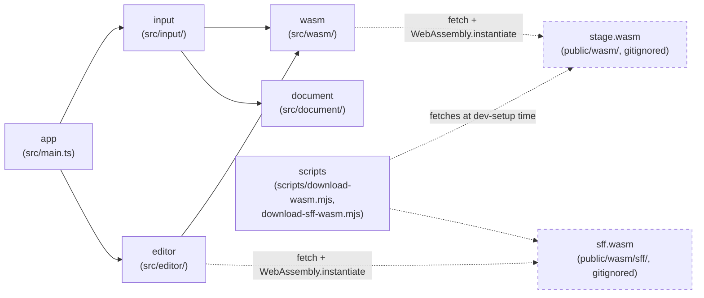

> Generated by /vibe:docs — manual edits will be overwritten; use README for hand-written content.

# Architecture

## Big picture

`stage-editor` is a static, backend-less site. All stage `.def` parsing and
serialization happens client-side, in the browser, through a WebAssembly
module built from the sibling [`stage`](https://github.com/openkakutou/stage)
Go library — this repo never reimplements `.def` parsing itself. Unlike the
sibling [`stage-viewer-web`](https://github.com/openkakutou/stage-viewer-web),
this app is write mode: it uses the same `stage.wasm` binary's `save` export
in addition to `load`.

- **`app`** (`src/main.ts`, `src/version.ts`, `src/style.css`) — the entry
  point. Builds the root layout: the org's shared `@openkakutou/web-ui-kit`
  app shell, a toolbar (app title + version) plus the stage file input, the
  characteristics editor, and the BG element editor as main content, all
  appearing automatically once a stage loads. No sidebar/tabs slotted yet.
  No save/dirty-state affordance either — save is a separate,
  not-yet-built item.
- **`input`** (`src/input/`) — the stage folder input (backlog item 002).
  `folder-entries.ts` gathers files from a folder selection or a
  drag-and-drop. `stage-file-input.ts` picks which gathered file is the
  stage's own `.def` (auto if there's exactly one, otherwise the caller
  must ask the user), reads and loads it through `wasm.loadStage`, then
  resolves the `.def`'s referenced sprite sheet from that same folder
  listing by filename — see the identical logic's own rationale in
  `stage-viewer-web`'s `.vibe/decisions/001-sprite-sheet-resolved-by-basename-with-case-insensitive-fallback.md`
  (ported here verbatim, not re-derived). `stage-file-input-view.ts`
  renders the folder-picker + drag-and-drop UI on top of that logic — the
  same success/error copy as `stage-viewer-web`'s own view, since nothing
  about the interaction is editor-specific yet.
- **`document`** (`src/document/`) — `stage-document-store.ts` holds the
  currently loaded stage in memory (a plain module-level get/set pair, no
  persistence): the file name, the parsed `StageData`, the original
  `.def` bytes (needed later by `saveStage`'s byte-exact-if-unchanged
  comparison), and the resolved sprite sheet's name/bytes. The single
  place later editor screens (the characteristics/BG element editor, item
  003; save/export, item 004) will read from and write back to. Loading a
  new folder always fully replaces the previous document, with no
  confirmation — nothing is editable yet, so there is no unsaved state a
  replace could lose.
- **`wasm`** (`src/wasm/`) — the bridge to the `stage` WebAssembly module.
  `bridge.ts` loads `wasm_exec.js` and instantiates `stage.wasm`
  client-side (both fetched from `public/wasm/`, gitignored — see
  "WebAssembly dependency" below), then exposes two typed wrappers:
  `loadStage(...)` around `OpenKakutouStage.load`, and `saveStage(...)`
  around `OpenKakutouStage.save` — the write-mode addition this repo needs
  that `stage-viewer-web`'s read-only bridge doesn't. `types.ts` is the
  TypeScript mirror of the module's JSON contract (`StageData` and its
  nested shapes, plus `StageResult`/`SaveResult`) — pure data types, no
  parsing logic. Only `loadStage` is called so far (via `input`); `saveStage`
  is wired up but unused until the save/export screen (backlog item 004).
- **`scripts`** (`scripts/download-wasm.mjs`, `download-sff-wasm.mjs`) —
  dev-only tooling, not part of the shipped app bundle. The first fetches a
  pinned `stage` release's `stage.wasm` + `wasm_exec.js` into `public/wasm/`;
  the second, a separate script (not a shared parameterized one — each
  downloads a different producer repo's release), fetches a pinned `sff`
  release's own `sff.wasm` + `wasm_exec.js` into `public/wasm/sff/` — a
  distinct subdirectory, so the two `wasm_exec.js` files (each only
  guaranteed compatible with the Go toolchain version that built the
  `.wasm` binary shipped next to it) never collide. Neither needs a Go
  toolchain or a sibling checkout of either repo.
- **`editor`** (`src/editor/`) — the two editing screens (backlog item
  003). `characteristics-editor.ts` edits a loaded stage's name, author,
  camera bounds, and stage boundaries. `elements-editor.ts` lists the
  stage's BG elements, one collapsed row each, expandable individually;
  add, edit, and remove. Both mutate the loaded `StageData` object `app`
  handed them in place — the same object reference `document`'s store
  holds, so no re-parse or explicit "save this back to the store" step is
  needed. `elements-editor.ts` additionally validates a BG element's
  sprite reference against the loaded sheet's actual sprites, via `wasm`'s
  second bridge (see "Sprite reference validation" below).

## WebAssembly dependency

`public/wasm/` (the `stage.wasm` binary and its `wasm_exec.js` loader) is
fetched, never committed — see `docs/development.md` for how to fetch it
locally. Once fetched, `wasm/bridge.ts` loads `wasm_exec.js` by executing
its source via `new Function(source)()` rather than a `<script>` tag or
`import()`, so the same loading code behaves identically in a real browser
and under the test suite's jsdom environment — the same loading strategy
`stage-viewer-web`'s own bridge uses (itself mirroring
`character-viewer-web`'s `.vibe/decisions/002-wasm-bridge-loading-and-result-shape.md`).

## Data flow: loading a stage

1. The user picks or drops a folder onto `input`'s view.
2. `input` gathers every file in it (recursing into subfolders), then
   picks the `.def` candidate — automatically if there's exactly one,
   otherwise the view prompts the user to choose among them.
3. The chosen `.def`'s bytes are read and handed to `wasm.loadStage`,
   which calls the WebAssembly module's `OpenKakutouStage.load` and parses
   its `{ stage, error }` JSON result into a typed `StageResult`.
4. `input` resolves the loaded stage's referenced sprite sheet from the
   same gathered folder listing (basename match, exact then
   case-insensitive) and reads its bytes too.
5. On success, `app` stores the result — file name, parsed stage, original
   `.def` bytes, and the resolved sprite sheet's name/bytes — in
   `document`'s store, fully replacing whatever was there before, and
   renders `editor`'s two screens against the loaded `StageData`. On
   failure, `input`'s view shows a specific, named error (which file, and
   why) instead.

## Sprite reference validation

`stage`'s own WASM module (`wasm/bridge.ts`) has no sprite-metadata surface
at all — only `load`/`save` on the `Stage` data model. To flag a BG
element's sprite reference that doesn't exist in the loaded sheet,
`elements-editor.ts` bridges `sff`'s own separate WASM module directly
(`wasm/sff-bridge.ts`, `OpenKakutouSff.load`) — metadata only, no pixel
decode, since only enumeration is needed to validate a reference. See
`.vibe/decisions/001-sff-wasm-bridged-directly-for-sprite-reference-validation.md`
for why this doesn't wait on `stage`'s own WASM growing that capability.
Called once per loaded stage, right after `app` stores it — rendered first
with `spriteGroups: null` (every reference reads as "loading"), then again
once the sheet's metadata resolves (or, on a decode failure, with an empty
list — every reference then reads as unverifiable rather than the editor
hanging on "loading" forever).

## Data flow: saving a stage (once the save/export screen lands)

1. `saveStage` is called with the *original* `.def` bytes (held in
   `document`'s store, for the byte-exact-if-unchanged comparison) plus the
   edited `StageData`.
2. It JSON-serializes the edited value and calls `OpenKakutouStage.save`,
   which re-parses the original internally — a malformed original is a
   real error path here, not just `load`'s.
3. The result is `{ ok: true, bytes }` (the serialized `.def` file) or
   `{ ok: false, error }`.
