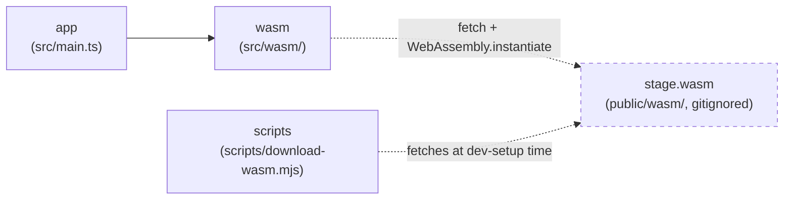

> Generated by /vibe:docs — manual edits will be overwritten; use README for hand-written content.

# Architecture

## Big picture

`stage-editor` is a static, backend-less site. All stage `.def` parsing and
serialization happens client-side, in the browser, through a WebAssembly
module built from the sibling [`stage`](https://github.com/openkakutou/stage)
Go library — this repo never reimplements `.def` parsing itself. Unlike the
sibling [`stage-viewer-web`](https://github.com/openkakutou/stage-viewer-web),
this app is write mode: it uses the same `stage.wasm` binary's `save` export
in addition to `load`.

- **`app`** (`src/main.ts`, `src/version.ts`, `src/style.css`) — the entry
  point. Builds the root layout: the org's shared `@openkakutou/web-ui-kit`
  app shell, a toolbar (app title + version) plus an empty main content
  region, ready for the file input and editing screens that later backlog
  items add. No sidebar/tabs slotted yet. No save/dirty-state affordance
  either — no editing capability exists yet, so a disabled save button or
  "unsaved changes" indicator would be a permanently non-functional
  control, not a useful signal.
- **`wasm`** (`src/wasm/`) — the bridge to the `stage` WebAssembly module.
  `bridge.ts` loads `wasm_exec.js` and instantiates `stage.wasm`
  client-side (both fetched from `public/wasm/`, gitignored — see
  "WebAssembly dependency" below), then exposes two typed wrappers:
  `loadStage(...)` around `OpenKakutouStage.load`, and `saveStage(...)`
  around `OpenKakutouStage.save` — the write-mode addition this repo needs
  that `stage-viewer-web`'s read-only bridge doesn't. `types.ts` is the
  TypeScript mirror of the module's JSON contract (`StageData` and its
  nested shapes, plus `StageResult`/`SaveResult`) — pure data types, no
  parsing logic. Nothing in `app` calls either function yet; that lands
  with the file input (backlog item 002) and the save/export screen
  (backlog item 004).
- **`scripts`** (`scripts/download-wasm.mjs`) — dev-only tooling, not part
  of the shipped app bundle. Fetches a pinned `stage` release's
  `stage.wasm` + `wasm_exec.js` into `public/wasm/` so contributors don't
  need a Go toolchain or a sibling `stage` checkout.

## WebAssembly dependency

`public/wasm/` (the `stage.wasm` binary and its `wasm_exec.js` loader) is
fetched, never committed — see `docs/development.md` for how to fetch it
locally. Once fetched, `wasm/bridge.ts` loads `wasm_exec.js` by executing
its source via `new Function(source)()` rather than a `<script>` tag or
`import()`, so the same loading code behaves identically in a real browser
and under the test suite's jsdom environment — the same loading strategy
`stage-viewer-web`'s own bridge uses (itself mirroring
`character-viewer-web`'s `.vibe/decisions/002-wasm-bridge-loading-and-result-shape.md`).

## Data flow: loading and saving a stage (once the file input lands)

1. `loadStage` is called with a stage `.def` file's raw bytes. On first
   call, the bridge fetches and instantiates `stage.wasm` (memoized —
   shared with `saveStage`, so later calls to either skip straight to the
   module call).
2. The bytes are handed to `OpenKakutouStage.load`, which returns a
   `{ stage, error }` JSON result — never throws, even on malformed input.
   `loadStage` parses that into a typed `StageResult`.
3. Once editing screens exist, the caller mutates its own in-memory
   `StageData` value from that result.
4. `saveStage` is called with the *original* `.def` bytes (for the
   byte-exact-if-unchanged comparison) plus the edited `StageData`. It
   JSON-serializes the edited value and calls `OpenKakutouStage.save`,
   which re-parses the original internally — a malformed original is a
   real error path here, not just `load`'s. The result is `{ ok: true,
   bytes }` (the serialized `.def` file) or `{ ok: false, error }`.
